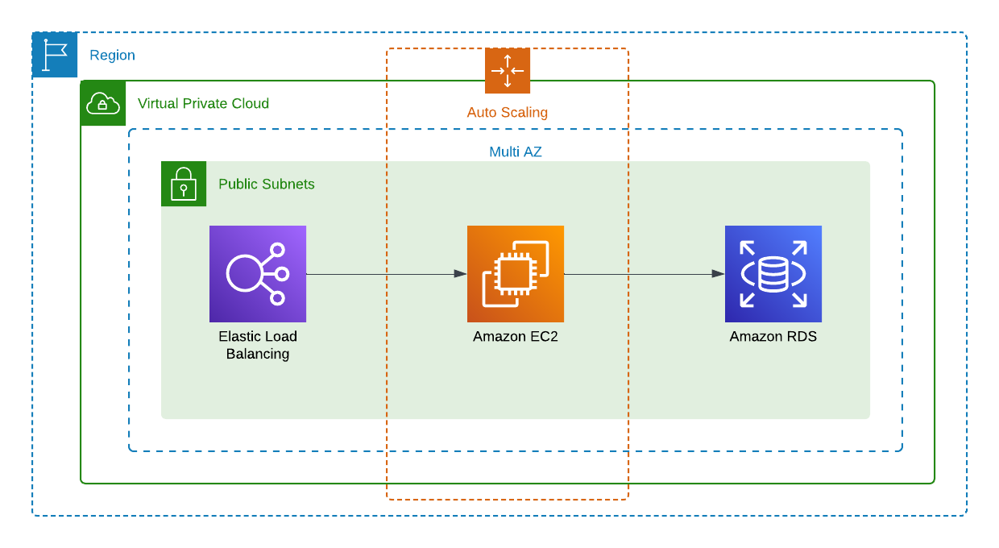
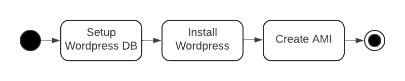

# WordPress Setup via Terraform on AWS

Setting up WordPress on AWS using Terraform provides a scalable and reliable infrastructure for your WordPress site. Terraform, as an Infrastructure as Code (IaC) tool, ensures that your infrastructure is version-controlled, reproducible, and easily maintainable. By leveraging AWS's cloud services, you can achieve high availability, security, and performance for your WordPress application.

## Table of Contents

- [Terraform Configurataion](#terraform-configuration)
- [Prerequisits](#prerequisits)
- [Usage](#usage)
- [Additional Notes](#additional-notes)
- [Clean Up](#clean-up)
- [Contributing](#contributing)

## Terraform Configuration

This Terraform configuration file creates and sets up the following AWS resources to host a WordPress site:



### VPC and Subnets

A Virtual Private Cloud (VPC) and three subnets in different availability zones to ensure high availability.
An Internet Gateway for outbound internet access.
Route tables and associations to route traffic appropriately.

### Security Groups

For the Aplication Load Balancer to allow https traffic, as well as security groups for the EC2 instance that run WordPress to allow http connections from the load balanacert. Furthermore, a wsecurity group specifically for the RDS (MySQL) instance to allow MySQL traffic.

### RDS Instance

An Amazon RDS MySQL instance to host the WordPress database.

### WordPress Setup Instance

An EC2 instance to set up WordPress and create an Amazon Machine Image (AMI) from it. The AMI is used for the launch template of the auto scaling group. The instance is launched after the RDS instance is ready and terminated after the AMI was created. The following steps are performed by this EC2 instance:



### Load Balancer and Auto Scaling

An Application Load Balancer to distribute traffic to WordPress instances.
An Auto Scaling Group to ensure that the WordPress instances are scaled according to demand.

## Prerequisits

Before you can use this Terraform configuration to set up WordPress on AWS, you need the following:

1. AWS Account: Ensure you have an AWS account with appropriate permissions to create the resources mentioned above.
2. Terraform Installed: Install Terraform on your local machine. You can download it from here.
3. AWS CLI Configured: Configure the AWS CLI with your credentials. You can follow the instructions here.

## Usage

Follow these steps to set up WordPress on your own AWS account using this Terraform configuration:

### Clone the Repository

```bash
git clone https://github.com/christian-dienbauer/wordpress-setup-aws-terraform
cd wordpress-setup-aws-terraform
```

### Initialize Terraform

Initialize Terraform to install the necessary providers and modules.

```bash
terraform init
```

### Configure Variables

Have a look at the [variables.tf](variables.tf) file and change the variables accordingly. Don't use the default variables, especially the one for passwords, in productions. Consider to use AWS Secrets Manager for password rotation.

### Plan the Infrastructure

Run the terraform plan command to see what resources will be created.

```bash
terraform plan
```

### Apply the Configuration

Apply the Terraform configuration to create the resources.

```bash
terraform apply
```

### Access Your WordPress Site

Once the infrastructure is created, you can access your WordPress site using the DNS name of the load balancer that is provided via a Terraform output via https.
<!-- 
- OUTPUT of the Terraform Template that shows the dns of the load balancer 
- Screenshot of the 
- -->

### Setup Custom Domain Name

If you have a domain name registered that you want to use for the WordPress instance you can use Route53 as a DNS and create an alias to point to the load balancer. Using the AWS Certificate Manager to serve a valid certificate via the load balancer.

## Additional Notes

1. Security: Ensure you handle sensitive information, such as database passwords, securely. Consider using AWS Secrets Manager for managing secrets.
2. Scaling: The Auto Scaling Group is set to maintain a single instance for simplicity. Adjust the desired capacity, minimum, and maximum size based on your needs.
3. AMI Creation: The configuration includes steps to create an AMI from a setup instance. This AMI is used for launching WordPress instances in the Auto Scaling Group.
<!-- 4. Multi AZ for RDS - The current setup operates the MySql RDS database within a single availablity zone to safe costs. If one wants to make it more robust it can be operated in multiple availability zones to improve Recovery Point Objective (RPO) and Recovery Time Objective (RTO). -->

## Clean Up

To avoid incurring unnecessary costs, destroy the Terraform-managed infrastructure when you no longer need it.

```bash
terraform destroy
```

## Contributing

If you have ideas for improvements or have already implemented them, please open a [GitHub Issue](../../issues) or a [Pull Request](../../pulls).

## License

This project is licensed under the MIT License - see the [LICENSE](LICENSE) file for details.
